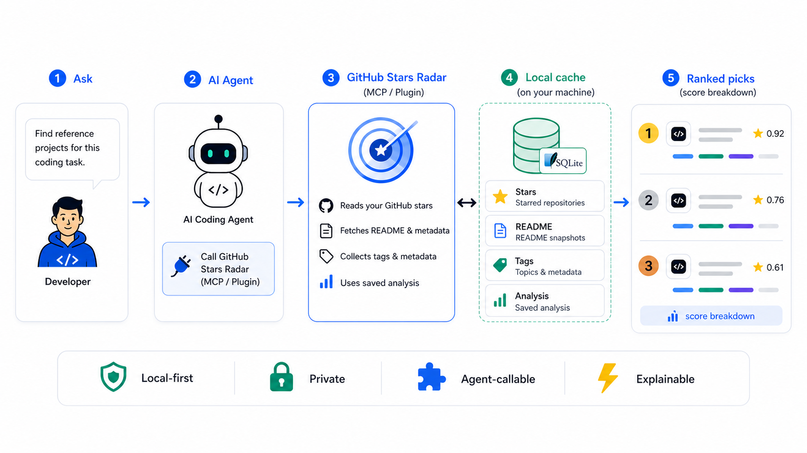

# GitHub Stars Radar

<p align="center">
  
  
  
  
  
</p>

<p align="center">
  <b>Turn years of GitHub stars into private technical memory your AI coding agents can query.</b>
</p>

<p align="center">
  <a href="README.md"></a>
  <a href="README.en.md"></a>
</p>

<p align="center">
  
</p>

## English

**GitHub Stars Radar** is a local-first memory layer for AI coding agents. It turns the repositories you have starred over the years, plus README snapshots, tags, metadata, and saved AI analysis, into private technical context that Codex, Claude Code, OpenClaw, Hermes, and other agents can query through MCP/plugins.

The GitHub API can give you a list of starred repositories. GitHub Stars Radar helps your agent use that list as memory: when you need technology choices, reference implementations, or tool recommendations, the agent can query projects you already collected and return explainable ranked picks.

It is not a GitHub star manager, not a dashboard, and not another awesome-list. It is a private, reusable open-source project memory layer for your AI coding agents.

If you want your AI coding agents to reuse the open-source projects you have collected over the years instead of starting from scratch every time, this repo is worth starring.

## Why It Exists

Your starred repositories are not just bookmarks. They are a long-term signal of your technical taste: frameworks, tools, templates, MCP servers, agent projects, CLIs, automation scripts, and reference implementations you already cared enough to save.

The problem is that this signal usually stays trapped inside GitHub. Your AI coding agents do not know it by default, and they do not automatically use it when choosing technology, finding reference implementations, or recommending tools.

GitHub Stars Radar turns those stars into a local-first, queryable, reusable agent memory layer that multiple AI coding assistants can share.

## Without It / With It

| Without GitHub Stars Radar | With GitHub Stars Radar |
| --- | --- |
| Agents search from scratch every time | Agents first query projects you already starred and filtered |
| GitHub Stars are just bookmarks | Stars become private technical memory |
| Different AI assistants do not share context | Codex, Claude Code, OpenClaw, and Hermes can reuse the same local memory |
| Recommendations are hard to audit | Ranked picks include `score_breakdown` and saved analysis |
| Repositories get re-analyzed repeatedly | Agents can save summary, tags, category, and notes |

## Good For

- Technology choices grounded in projects you already trust.
- Finding reference implementations from your long-term collection.
- Sharing one local project memory across Codex, Claude Code, OpenClaw, and Hermes.
- Reusing MCP servers, agent projects, CLI tools, and automation scripts.
- Preserving repository analysis so future agents do not repeat the same work.

## Ask Your Agent Like This

```text
Check my GitHub Stars first. I want to build a local-first MCP tool.
Which starred projects should I reference? Explain fit, trade-offs, and score_breakdown.
```

That is where GitHub Stars Radar fits best: not manual bookmark browsing, but agent-triggered access to your private technical memory when context matters.

## Why Not Just The GitHub API?

The GitHub API can tell you which repositories you starred. It does not know:

- Which repositories fit the current task.
- Which README files have already been read by an agent.
- Which projects were analyzed, categorized, or tagged before.
- Why one repository is a better reference than another.
- How multiple AI coding assistants should reuse the same local context.

GitHub Stars Radar handles the second half: turning raw stars into queryable, reusable, explainable private technical memory for AI agents.

## Quickstart

Choose one installation route. You do not need to ask AI to install the project and then install it manually again.

### Option 1: AI-Assisted Installation

Use this when you are already working inside Codex, Claude Code, OpenClaw, or Hermes. Paste this prompt into the current AI client:

```text
Please install and connect GitHub Stars Radar.
Repository: https://github.com/NeoZhouCHN/github-stars-radar
Local path: <your-project-path>/github-stars-radar
Target client: Codex / Claude Code / OpenClaw / Hermes

Please:
1. Check that Python is available. On Windows, try py first. On macOS/Linux, try python3 first.
2. Check whether .env exists. If not, copy .env.example to .env. Do not read, print, or log my token.
3. Check that GITHUB_TOKEN, GH_TOKEN, or gh auth token is available.
4. For Codex, prefer installing adapters/codex as a Codex plugin. If plugin installation is unavailable, fall back to MCP config.
5. For Claude Code, prefer installing the repository root as a Claude Code plugin with .claude-plugin/plugin.json and .mcp.json. If plugin installation is unavailable, fall back to MCP config.
6. For OpenClaw or Hermes, configure the stdio MCP server with command py or python3, args pointing to mcp-server/server.py, and env.GITHUB_STARS_RADAR_DB set to a local SQLite path.
7. Run scripts/smoke_mcp.py.
8. Tell me which config files changed, whether verification passed, and how to call github-stars-radar next.

Do not commit data/*.sqlite, data/*.json, .env, or any token.
```

### Option 2: Manual Installation

Use this when you want direct control over config files, MCP paths, and environment variables. Manual installation has three parts:

1. Clone this project and create `.env`.
2. Configure a GitHub token, or use an authenticated `gh` CLI.
3. Connect the plugin or MCP server for your target client.

The following sections show the manual install routes for Codex, Claude Code, OpenClaw, and Hermes.

## Core Capabilities

| Capability | Value for AI coding agents |
| --- | --- |
| Local stars cache | Agents query projects you already trust instead of searching randomly |
| README snapshots | Recommendations can use real project descriptions, not just repo names and topics |
| Tags, metadata, and change tracking | Agents can judge language, topic, activity, and collection changes |
| Saved agent analysis | One agent's repository analysis can be reused by future agents |
| Explainable recommendations | `score_breakdown` makes ranked picks easier to audit |
| TTL auto-sync | Stale cache refreshes automatically; old cache remains usable if sync fails |
| MCP / Plugin integration | Codex, Claude Code, and other MCP clients can call the same tools |

## MCP Vs Plugin

The MCP server provides the actual tools: `sync_stars`, `sync_readmes`, `search_stars`, `recommend_stars_for_task`, `get_readme`, `save_analysis`, and more.

Plugins are installation and guidance bundles. Codex and Claude Code can use plugin metadata and skills/instructions. OpenClaw and Hermes should use the generic stdio MCP configuration unless they have a verified plugin format for your environment.

## Setup Requirements

Requirements:

- Python 3.11 or newer
- A GitHub token, or an authenticated `gh` CLI
- This project checked out locally

Get a GitHub token:

- Official docs: [Managing your personal access tokens](https://docs.github.com/en/authentication/keeping-your-account-and-data-secure/managing-your-personal-access-tokens)
- Fine-grained token page: [https://github.com/settings/personal-access-tokens/new](https://github.com/settings/personal-access-tokens/new)
- Classic token page: [https://github.com/settings/tokens/new](https://github.com/settings/tokens/new)

## Windows Installer Users

If you download `GitHubStarsRadarSetup-<version>.exe` from Releases, the installed app includes:

- `github-stars-radar.exe`: the MCP server
- `GitHubStarsRadarConfig.exe`: a local configuration helper

Recommended flow:

1. Run the installer.
2. Open **GitHub Stars Radar Config**.
3. Paste a GitHub token to generate local `.env`.
4. Generate `generated/github-stars-radar.mcp.json`.
5. Add the generated MCP config to Codex, Claude Code, OpenClaw, or Hermes.
6. In the AI client, run `sync_stars` or `search_stars` to test it. If you want README cache coverage, run `sync_readmes` in batches.

The installer installs the tool and generates config files. It does not silently modify every AI client configuration because client schemas and config locations vary.

## Manual Setup: Clone And Initialize

Clone and initialize:

```bash
git clone https://github.com/NeoZhouCHN/github-stars-radar.git
cd <your-project-path>/github-stars-radar
cp .env.example .env
```

On Windows PowerShell:

```powershell
git clone https://github.com/NeoZhouCHN/github-stars-radar.git
cd <your-project-path>/github-stars-radar
copy .env.example .env
```

Set one token variable:

```text
GITHUB_TOKEN=your GitHub token
GH_TOKEN=
GITHUB_STARS_RADAR_DB=./data/stars.sqlite
```

Or:

```text
GITHUB_TOKEN=
GH_TOKEN=your GitHub token
GITHUB_STARS_RADAR_DB=./data/stars.sqlite
```

## Local Verification

Windows:

```powershell
py -m unittest discover -s tests -v
py scripts/smoke_mcp.py
py scripts/check_manifests.py
```

macOS / Linux:

```bash
python3 -m unittest discover -s tests -v
python3 scripts/smoke_mcp.py
python3 scripts/check_manifests.py
```

## Install Routes

Codex:

- Install `adapters/codex` as a Codex plugin.
- If plugin installation is unavailable, copy `adapters/codex/.mcp.json` into your Codex MCP configuration.

Claude Code:

- Install the repository root as a Claude Code plugin.
- It includes `.claude-plugin/plugin.json`, `.mcp.json`, and `skills/github-stars-radar/SKILL.md`.

OpenClaw / Hermes:

- Configure the generic stdio MCP server.

```json
{
  "mcpServers": {
    "github-stars-radar": {
      "command": "python3",
      "args": ["<your-project-path>/github-stars-radar/mcp-server/server.py"],
      "env": {
        "GITHUB_STARS_RADAR_DB": "<your-project-path>/github-stars-radar/data/stars.sqlite"
      }
    }
  }
}
```

On Windows, use `py` if that is your working Python launcher.

## Cache Strategy

- `sync_stars` is a fast metadata sync. It does not batch-fetch README files.
- `sync_readmes` backfills missing README cache entries in small batches. The default batch size is 25.
- TTL freshness is based only on a successfully completed `sync_stars` run. Interrupted or failed sync attempts do not make the cache look fresh.
- On first use with many starred repositories, run `sync_stars` first, then call `sync_readmes` repeatedly only when README text is useful for deeper matching.

## License

MIT License. See `LICENSE`.
