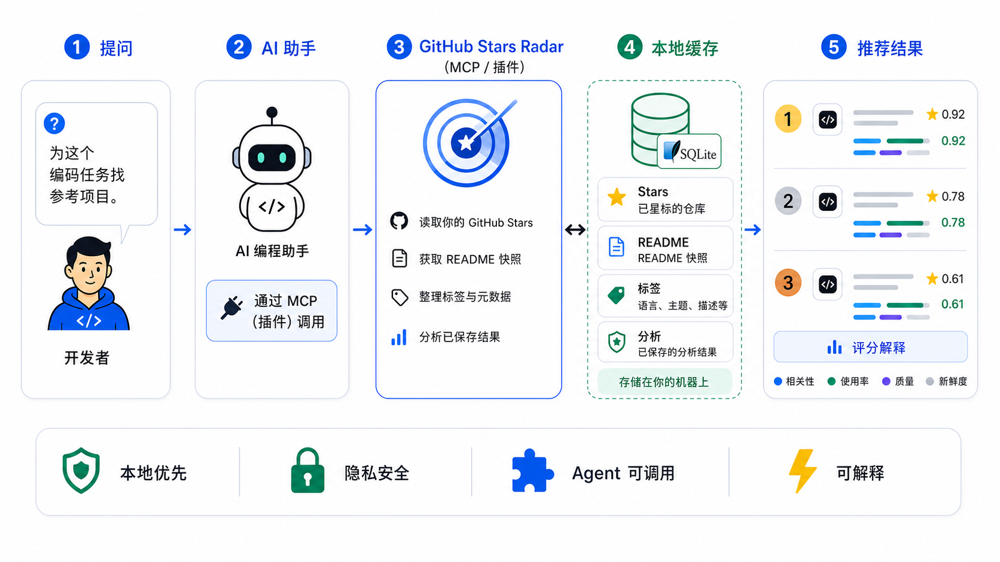

# GitHub Stars Radar

<p align="center">
  
  
  
  
  
</p>

<p align="center">
  <b>把你多年收藏的开源项目，变成 AI 编程助手可调用的私人技术记忆。</b>
</p>

<p align="center">
  <a href="README.md"></a>
  <a href="README.en.md"></a>
</p>

<p align="center">
  
</p>

## 中文

**GitHub Stars Radar** 是一个 local-first 的 AI agent 记忆层。它把你多年 Star 过的 GitHub 项目、README 快照、标签、元数据和 AI 分析结果，整理成 Codex、Claude Code、OpenClaw、Hermes 等编程助手可以通过 MCP/plugin 查询的私人技术上下文。

GitHub 官方 API 只能给你一份 starred repositories 列表；GitHub Stars Radar 让 AI 在做技术选型、寻找参考实现、推荐工具时，先查询你真实收藏过、筛选过、分析过的项目，再给出带评分解释的推荐。

它不是 GitHub Star 管理器，不是 dashboard，也不是另一个 awesome-list。它的目标是让你的 AI 编程助手拥有一份属于你的、可复用的开源项目记忆。

如果你也希望 AI 编程助手复用你多年收藏过的好项目，而不是每次从零搜索，这个项目值得先 Star。

## 为什么需要它

你 Star 过的仓库，其实是一份长期积累的技术偏好：你认可过的框架、工具、模板、MCP server、agent 项目、CLI、自动化脚本和参考实现。

问题是，这份偏好通常只停留在 GitHub 收藏夹里。AI 编程助手默认不知道它，也不会在做选型、找参考实现或推荐工具时主动查询它。

GitHub Stars Radar 把这份收藏变成一个本地优先、可查询、可复用的 agent memory layer，让不同 AI 编程助手能共享同一份私人技术上下文。

## 没有它 / 有了它

| 没有 GitHub Stars Radar | 有了 GitHub Stars Radar |
| --- | --- |
| AI 每次从零搜索项目 | AI 先查你 Star 过、筛选过的项目 |
| GitHub Stars 只是收藏夹 | Stars 变成私人技术记忆 |
| 不同 AI 助手互不共享上下文 | Codex、Claude Code、OpenClaw、Hermes 可复用同一份本地记忆 |
| 推荐理由难以追踪 | 推荐结果带 `score_breakdown` 和已保存分析 |
| 看过的仓库下次还要重新分析 | AI 可以保存 summary、tags、category 和 notes |

## 适合哪些场景

- 做技术选型时，让 AI 先查你认可过的项目。
- 找参考实现时，从你的长期收藏里筛候选，而不是完全依赖实时搜索。
- 让 Codex、Claude Code、OpenClaw、Hermes 共享同一份本地项目记忆。
- 给 MCP server、agent 项目、CLI 工具、自动化脚本找可复用实现。
- 让 AI 读过的仓库分析结果沉淀下来，下次继续复用。

## 你可以这样问 AI

```text
先查我的 GitHub Stars。我要做一个本地优先的 MCP 工具，有哪些我收藏过的项目可以参考？
请按适用原因、不适用原因和 score_breakdown 给我推荐。
```

这类问题才是 GitHub Stars Radar 最适合的位置：不是让你手动翻收藏夹，而是让 AI 在需要上下文时主动调用你的私人技术记忆。

## 为什么不是 GitHub API 包装器？

GitHub API 能返回你 Star 过哪些仓库，但它不知道：

- 哪些仓库适合当前任务。
- 哪些 README 已经被 AI 读过。
- 哪些项目曾经被你分析、分类、打过标签。
- 为什么某个仓库比另一个更适合作为参考。
- 如何让多个 AI 编程助手复用同一份本地上下文。

GitHub Stars Radar 做的是后一半：把原始 Stars 变成 AI agent 可查询、可复用、可解释的私人技术记忆。

## 快速开始

下面两种方式选一种即可，不需要先让 AI 安装再手动安装。

### 方式一：让 AI 辅助安装

适合已经在 Codex、Claude Code、OpenClaw 或 Hermes 里工作的开发者。把下面这段 prompt 发给当前 AI，它会按客户端类型选择安装方式：

- **Codex**：优先安装 Codex plugin。
- **Claude Code**：优先安装 Claude Code plugin。
- **OpenClaw / Hermes**：按通用 stdio MCP server 接入。

```text
请帮我安装并接入 GitHub Stars Radar。
项目仓库：https://github.com/NeoZhouCHN/github-stars-radar
本地项目路径：<your-project-path>/github-stars-radar
目标客户端：Codex / Claude Code / OpenClaw / Hermes（选择一个或多个）

请你：
1. 检查 Python 是否可用。Windows 优先尝试 py，macOS/Linux 优先尝试 python3。
2. 检查 .env 是否存在；如果不存在，从 .env.example 复制一份。不要读取、打印或记录我的 token。
3. 检查 GITHUB_TOKEN、GH_TOKEN 或 gh auth token 是否至少一种可用。
4. 如果目标客户端是 Codex：优先安装 adapters/codex/.codex-plugin/plugin.json；如果当前 Codex 环境不能安装 plugin，再退回通用 MCP 配置。
5. 如果目标客户端是 Claude Code：优先按仓库根目录的 .claude-plugin/plugin.json 和 .mcp.json 安装 plugin；如果当前 Claude Code 环境不能安装 plugin，再退回通用 MCP 配置。
6. 如果目标客户端是 OpenClaw 或 Hermes：按 stdio MCP server 方式接入，command 使用 py 或 python3，args 指向 mcp-server/server.py，env 设置 GITHUB_STARS_RADAR_DB。
7. 运行 scripts/smoke_mcp.py 做 smoke test。
8. 最后告诉我：修改了哪些配置文件、验证命令是否通过、我下一步应该怎么调用 github-stars-radar。

不要提交 data/*.sqlite、data/*.json、.env 或任何 token。
```

### 方式二：开发者手动安装

适合想自己控制配置文件、MCP 路径和环境变量的开发者。手动安装需要完成三件事：

1. 下载本项目并创建 `.env`。
2. 配置 GitHub token 或已经登录的 `gh` CLI。
3. 按目标客户端接入 plugin 或 MCP server。

后续章节分别给出 Codex、Claude Code、OpenClaw 和 Hermes 的手动配置方式。

## 核心能力

| 能力 | 对 AI 编程助手的价值 |
| --- | --- |
| 本地 Stars 缓存 | 让 agent 先查你认可过的项目，而不是从互联网随机搜索 |
| README 快照 | 让推荐基于项目真实说明，不只看 repo 名和 topic |
| 标签、元数据和变化检测 | 帮 AI 判断项目语言、主题、活跃度和收藏变化 |
| 保存 AI 分析 | 一个 agent 分析过的项目，后续 agent 可以复用结论 |
| 可解释推荐 | `score_breakdown` 让推荐理由可追踪，方便你判断是否可信 |
| TTL 自动刷新 | 缓存过期时自动同步；同步失败也能继续使用旧缓存 |
| MCP / Plugin 接入 | Codex、Claude Code 和其他 MCP 客户端可以调用同一套 tools |

## MCP 和 Plugin 有什么区别

| 形式 | 适合谁 | 说明 |
| --- | --- | --- |
| 通用 MCP | OpenClaw、Hermes、任何支持 stdio MCP 的客户端 | 最通用，只提供工具调用 |
| Codex plugin | Codex | 把 MCP 配置和说明打包起来，安装更方便 |
| Claude Code plugin | Claude Code | 把 MCP 配置、skills/说明一起作为插件安装 |

核心功能来自 MCP server，所以无论用 plugin 还是 MCP，调用的工具都是同一套：`sync_stars`、`sync_readmes`、`search_stars`、`recommend_stars_for_task`、`get_readme`、`save_analysis` 等。

区别在于：plugin 更像安装包和说明书，MCP 是真正提供工具调用的服务。Skills/说明能不能自动触发，取决于客户端是否支持 plugin/skill 机制；MCP tools 本身是通用的。

## 安装前准备

你需要：

- Python 3.11 或更高版本
- 一个 GitHub Token，或已经登录好的 `gh` CLI
- 本项目源码

`GITHUB_TOKEN` 和 `GH_TOKEN` 都是环境变量名，用来存放 GitHub Personal Access Token。你只需要填其中一个；如果两个都填，项目会优先读取 `GITHUB_TOKEN`。`GH_TOKEN` 这个名字常见于 GitHub CLI 和自动化脚本。

获取 token：

- GitHub 官方说明：[Managing your personal access tokens](https://docs.github.com/en/authentication/keeping-your-account-and-data-secure/managing-your-personal-access-tokens)
- Fine-grained token 创建页：[https://github.com/settings/personal-access-tokens/new](https://github.com/settings/personal-access-tokens/new)
- Classic token 创建页：[https://github.com/settings/tokens/new](https://github.com/settings/tokens/new)

只同步公开 star 时，GitHub Token 通常不需要额外权限。若要读取 private starred repositories，token 需要能读取这些 private repositories。创建后只复制一次，像密码一样保存，不要发给 AI，也不要提交到 GitHub。

## Windows 安装包用户

如果从 Releases 下载 `GitHubStarsRadarSetup-<version>.exe`，安装完成后会包含：

- `github-stars-radar.exe`：MCP server 主程序
- `GitHubStarsRadarConfig.exe`：本地配置助手

推荐流程：

1. 运行安装包。
2. 打开 **GitHub Stars Radar Config**。
3. 输入 GitHub token，生成本地 `.env`。
4. 生成 `generated/github-stars-radar.mcp.json`。
5. 把生成的 MCP 配置添加到 Codex、Claude Code、OpenClaw 或 Hermes。
6. 在 AI 客户端里运行 `sync_stars` 或 `search_stars` 测试；如需补全 README 缓存，再分批运行 `sync_readmes`。

安装包只负责安装工具和生成配置文件，不会自动修改所有 AI 客户端的配置。不同客户端的 MCP 配置位置和格式可能不同，保守做法是生成可复制的配置片段。

## 手动安装：下载和初始化

把 `<your-project-path>` 换成你自己电脑上的项目目录。

Windows PowerShell：

```powershell
git clone https://github.com/NeoZhouCHN/github-stars-radar.git
cd <your-project-path>/github-stars-radar
copy .env.example .env
```

macOS / Linux：

```bash
git clone https://github.com/NeoZhouCHN/github-stars-radar.git
cd <your-project-path>/github-stars-radar
cp .env.example .env
```

编辑 `.env`，二选一填入 token：

```text
GITHUB_TOKEN=你的 GitHub token
GH_TOKEN=
GITHUB_STARS_RADAR_DB=./data/stars.sqlite
```

或者：

```text
GITHUB_TOKEN=
GH_TOKEN=你的 GitHub token
GITHUB_STARS_RADAR_DB=./data/stars.sqlite
```

如果你已经安装并登录 `gh` CLI，也可以不填 token：

```powershell
gh auth login
gh auth token
```

## 本地验证

Windows：

```powershell
py -m unittest discover -s tests -v
py scripts/smoke_mcp.py
py scripts/check_manifests.py
```

macOS / Linux：

```bash
python3 -m unittest discover -s tests -v
python3 scripts/smoke_mcp.py
python3 scripts/check_manifests.py
```

## 手动安装：Codex Plugin

Codex 推荐优先用 plugin 方式安装。本仓库提供：

- `adapters/codex/.codex-plugin/plugin.json`
- `adapters/codex/.mcp.json`

基本步骤：

1. 下载本项目。
2. 配置 `.env` 或环境变量。
3. 把 `adapters/codex` 目录安装为 Codex plugin。
4. 如果你的 Codex 环境暂时不能安装本地 plugin，就把 `adapters/codex/.mcp.json` 里的 MCP 配置复制到 Codex 的 MCP 配置中。
5. 新开一个 Codex 会话，确认能看到 `github-stars-radar` 工具。

可以这样试：

```text
先用 GitHub Stars Radar 搜一下我收藏过的 MCP / agent 项目，推荐 5 个最适合当前任务的仓库，并说明适用原因、不适用原因和下一步验证方式。
```

## 手动安装：Claude Code Plugin

Claude Code 推荐优先用 plugin 方式安装。本仓库根目录提供：

- `.claude-plugin/plugin.json`
- `.mcp.json`
- `skills/github-stars-radar/SKILL.md`

基本步骤：

1. 下载本项目。
2. 配置 `.env` 或环境变量。
3. 把仓库根目录安装为 Claude Code plugin。
4. Claude Code 读取 `.mcp.json` 启动 `mcp-server/server.py`，并发现 `skills/` 里的使用说明。
5. 如果你的 Claude Code 环境暂时不能安装 plugin，就退回通用 MCP 配置。

可以这样试：

```text
调用 github-stars-radar。先运行 sync_stars，再列出未分析的 starred repositories。选择 5 个仓库，读取 README，并用 summary/tags/category/platforms/notes 保存分析结果。
```

## 手动安装：OpenClaw / Hermes MCP

OpenClaw 和 Hermes 使用保守的通用 MCP 接入方式。如果客户端支持 stdio MCP server，配置：

```json
{
  "mcpServers": {
    "github-stars-radar": {
      "command": "python3",
      "args": ["<your-project-path>/github-stars-radar/mcp-server/server.py"],
      "env": {
        "GITHUB_STARS_RADAR_DB": "<your-project-path>/github-stars-radar/data/stars.sqlite"
      }
    }
  }
}
```

Windows 可以把 `command` 改成 `py`。

如果客户端使用不同配置格式，保留这三个核心值并映射过去：

- `command`: `python3` 或 `py`
- `args`: `["<your-project-path>/github-stars-radar/mcp-server/server.py"]`
- `env.GITHUB_STARS_RADAR_DB`: 本地 SQLite 缓存路径

可以这样试：

```text
使用 github-stars-radar 搜索我收藏过的 agent、MCP、自动化项目。为当前任务推荐最有用的仓库。
```

### 给 OpenClaw / Hermes 添加自动调用策略

只安装 MCP 会暴露工具，但不保证 AI 会自动想起调用它。Codex 和 Claude Code plugin 可以携带 skills 或说明；如果 OpenClaw 或 Hermes 只接了 MCP，请把下面这段加到客户端的 system prompt、project instructions、agent rules 或类似配置里：

```text
当用户任务涉及以下内容时，优先调用 github-stars-radar：
- 查找开源项目、库、工具、MCP server、plugin、agent 项目或参考实现
- 技术选型、方案对比、架构调研、自动化工具推荐
- 用户提到“我收藏过的仓库”、“GitHub Stars”或以前保存过的仓库
- 当前任务可能受益于复用用户已经 star 过的项目

推荐调用顺序：
1. 用 recommend_stars_for_task 为当前任务找候选仓库。
2. 用户给关键词时用 search_stars。
3. 对重点候选用 get_star 查看本地分析。
4. 需要最新上游 README 时用 get_readme。
5. 分析完仓库后用 save_analysis 保存 summary/tags/category/platforms/notes，避免后续 agent 重复分析。

如果本地缓存过期，允许工具默认 TTL 自动同步。如果同步失败但有旧缓存，继续使用旧缓存，并向用户说明这个状态。
```

## 常用 MCP Tools

| Tool | 用途 |
| --- | --- |
| `sync_stars` | 强制快速同步 starred repositories 的 metadata，不批量抓 README |
| `sync_readmes` | 分批补全缺失的 README 缓存，默认一次 25 个 |
| `search_stars` | 搜索本地 stars |
| `recommend_stars_for_task` | 按任务推荐仓库 |
| `get_unanalyzed_stars` | 找出还没有保存 AI 分析的仓库 |
| `get_star` | 读取一个本地仓库记录 |
| `get_readme` | 读取 GitHub 当前 README |
| `save_analysis` | 保存结构化 agent 分析 |
| `list_categories` | 查看分类统计 |
| `list_star_changes` | 查看新增、删除、更新记录 |
| `export_codex_context` | 导出适合 Codex 使用的上下文 prompt |

默认缓存策略：

- `auto_sync=true`
- `max_cache_age_minutes=360`
- `allow_stale=true`
- TTL 只以成功完成的 `sync_stars` 为准；中断或失败的同步不会把缓存伪装成新鲜状态。
- 首次 Star 很多时，先用 `sync_stars` 建立 metadata 缓存，再用 `sync_readmes` 分批补 README，避免 MCP 调用超时。

## License

MIT License. See `LICENSE`.
